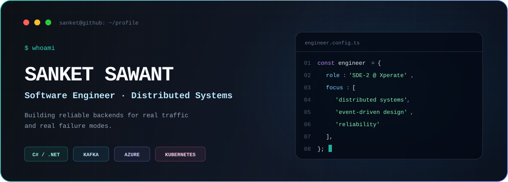
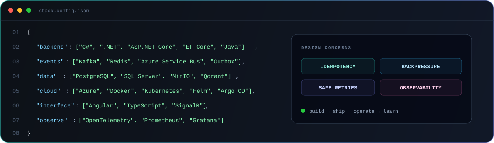

  

  <a href="https://www.linkedin.com/in/sanket-sawant-02b80a252/"><strong>LinkedIn</strong></a>
  &nbsp;·&nbsp;
  <a href="https://leetcode.com/u/Sanket9326/"><strong>LeetCode</strong></a>
  &nbsp;·&nbsp;
  <a href="https://www.geeksforgeeks.org/user/sawantsasrdd/"><strong>GeeksforGeeks</strong></a>
  &nbsp;·&nbsp;
  <a href="https://github.com/Sanket9326?tab=repositories"><strong>Repositories</strong></a>

## Hello, I'm Sanket 👋

I'm a backend-focused software engineer who enjoys turning complex workflows into systems that are predictable, observable, and easy to operate.

I currently work as an **SDE-2 at Xperate**, building .NET services and cloud integrations on Azure. My interests sit at the intersection of **distributed systems**, **event-driven architecture**, and **system design**—especially the reliability details that matter when services fail, messages arrive twice, or traffic spikes.

- 🔭 Building scalable platforms with **C#, .NET, Kafka, Redis, and Azure**
- 🧭 Designing for **idempotency, retries, dead-letter queues, and observability**
- 🌱 Exploring deeper patterns in **cloud-native delivery and distributed data**
- 🧠 Solved **1,400+ algorithm problems** on LeetCode

## Selected systems

### [Distributed Search Engine →](https://github.com/Sanket9326/Distrubuted-Search-Engine)

An event-driven document search platform with department-aware hybrid retrieval and grounded RAG answers. Documents move through a Kafka ingestion pipeline into PostgreSQL and Qdrant, with Redis-backed retries, reranking, metrics, and GitOps delivery.

`C#` `ASP.NET Core` `Kafka` `Redis` `Qdrant` `Angular` `Kubernetes` `Argo CD`

### [StreamForge →](https://github.com/Sanket9326/Distributed-StreamForge)

A learning-focused distributed video platform built with .NET microservices and Angular. Its ingestion slice streams large uploads to MinIO, commits metadata and an outbox event to PostgreSQL, and publishes processing events to Kafka asynchronously.

`.NET 10` `YARP` `PostgreSQL` `MinIO` `Kafka` `Angular` `Docker`

### [Distributed Event Forwarder →](https://github.com/Sanket9326/Distributed-Event-Forwarder)

A fault-tolerant event forwarding engine that consumes Kafka messages, applies routing and downstream rate limits, and handles delivery with distributed locking, idempotency, delayed retries, and dead-letter queues.

`.NET` `Kafka` `Redis` `Lua` `Docker` `Prometheus`

## Core toolbox

  

## How I approach engineering

> **Make the happy path fast. Make the failure path deliberate. Make both observable.**

I value clear boundaries, small contracts, and operationally boring systems. A strong design should explain not only how data moves when everything works, but also what happens during retries, partial failures, duplicate delivery, and recovery.

## Beyond the architecture diagrams

I sharpen my problem-solving through data structures and algorithms, with **1,400+ problems solved** on [LeetCode](https://leetcode.com/u/Sanket9326/). I also enjoy learning by building complete systems—from Angular interfaces to asynchronous workers and the infrastructure between them.

  <strong>Have an interesting backend or distributed-systems problem?</strong> 
  <a href="https://www.linkedin.com/in/sanket-sawant-02b80a252/">Let's connect on LinkedIn.</a>

