<picture>
  <source media="(max-width: 600px)" srcset="./assets/hero-mobile.svg" />
  
</picture>

  
  
  

### A little about me

I build **.NET backends, event-driven systems, and cloud integrations**. I like the engineering behind a smooth experience: clear contracts, fast APIs, and services that recover gracefully when something fails.

Currently going deeper into **distributed systems, system design, and observability**. Away from service boundaries and message queues, you'll find me working through algorithms on LeetCode.

### The stack

<picture>
  <source media="(max-width: 600px)" srcset="./assets/toolbox-mobile.svg" />
  
</picture>

### Practice, measured

<a href="https://leetcode.com/u/Sanket9326/">
  <picture>
    <source media="(max-width: 600px)" srcset="./assets/leetcode-mobile.svg" />
    
  </picture>
</a>

### Behind the commits

<picture>
  <source media="(max-width: 600px)" srcset="./assets/github-mobile.svg" />
  
</picture>

  
A few things I care about when building systems

  - **Clear boundaries.** Small contracts that make changes easier to reason about.
  - **Deliberate recovery.** Idempotency, bounded retries, and useful dead-letter queues.
  - **Visible behavior.** Traces, metrics, and logs that help explain what happened.
  - **Strong fundamentals.** Understanding the trade-offs before adding more moving parts.

 

  <strong>Always up for a good engineering conversation.</strong> 
  <a href="https://www.linkedin.com/in/sanket-sawant-02b80a252/">Let's connect ↗</a>

